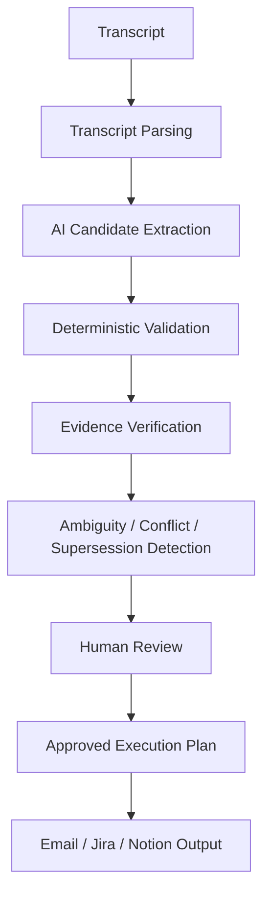
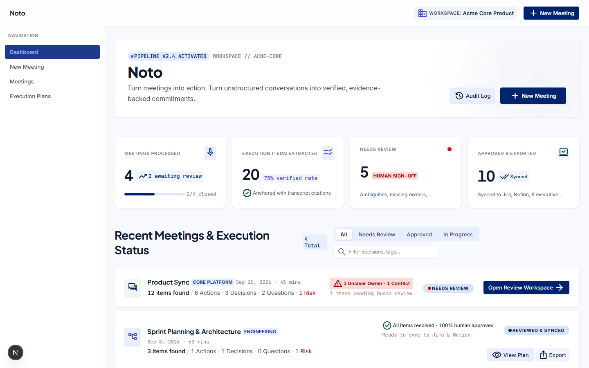
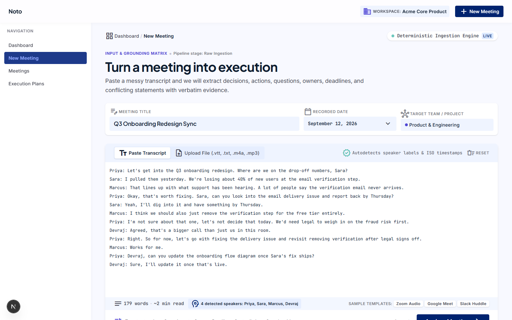
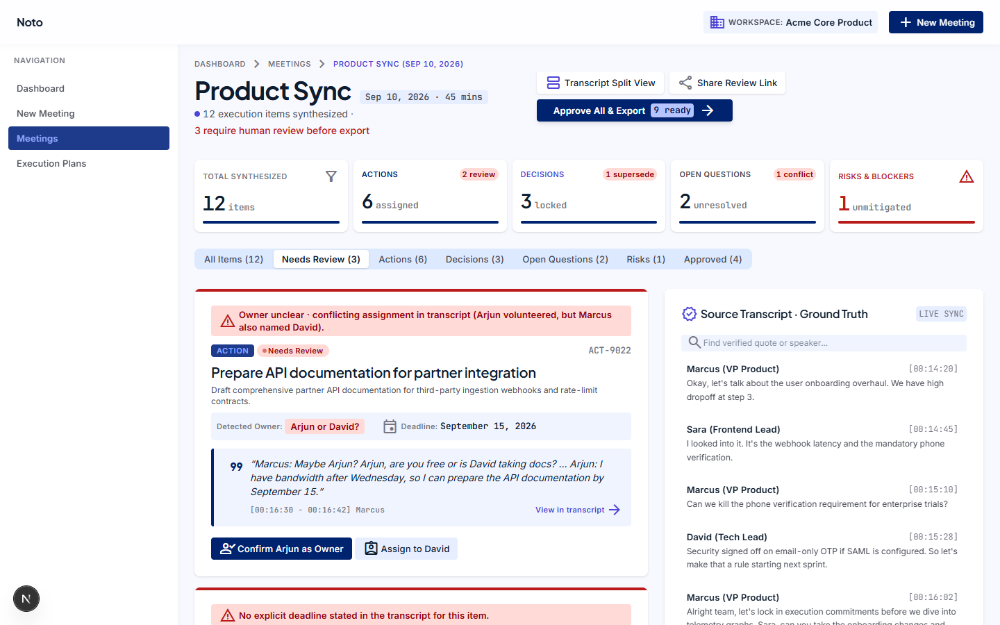
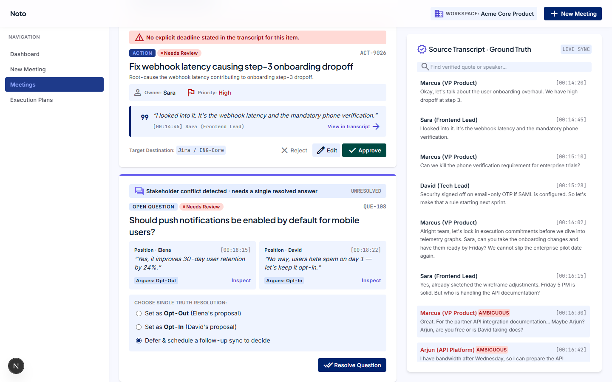
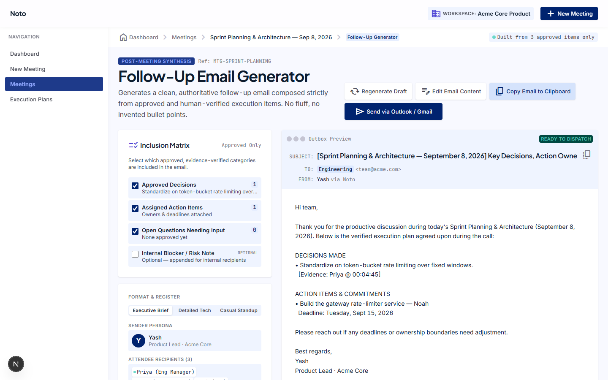
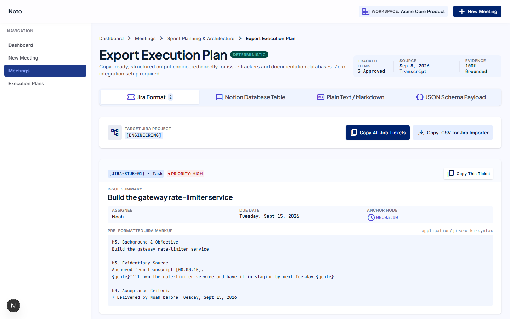

# Noto

**Turn meetings into action.**

Noto takes a messy meeting transcript and turns it into a structured, reviewable execution plan — decisions, action items, owners, deadlines, open questions, and risks, each tied back to the exact line in the transcript it came from. I built it as an AI Product Management portfolio project, and this README is my honest writeup of what it does, how it's built, what I evaluated, and what I got wrong along the way.

## The Problem

Meeting transcripts already contain everything you need: decisions, tasks, owners, deadlines, unresolved questions, and sometimes outright conflicting statements. The hard part was never summarizing the meeting — any LLM can do that in one prompt. The hard part is turning a messy conversation into something you can actually act on without quietly inventing information that was never said.

That's the failure mode I kept running into with plain LLM summarization: it sounds confident and clean, but it will happily assign an owner nobody volunteered for, pick a deadline out of a vague "sometime next week," or present a proposal as if the room had actually agreed on it. None of that is obvious until someone downstream trusts it and acts on the wrong thing.

## What Noto Does

1. You paste a meeting transcript.
2. Gemini extracts candidate decisions, actions, open questions, and risks.
3. Every candidate has to be backed by an evidence quote from the transcript.
4. A deterministic (non-AI) validation layer checks that AI output before anyone sees it.
5. Ambiguity, conflicting statements, and superseded decisions get surfaced instead of silently resolved.
6. A human reviews every item — edits, approves, or rejects it.
7. Approved items get compiled into an execution plan.
8. From there, Noto generates a follow-up email draft and copy-ready Jira and Notion output.

One thing I want to be upfront about: **Jira and Notion are copy-ready outputs, not live integrations.** Noto formats the approved items into Jira ticket markup and Notion-ready markdown you can paste in — it doesn't call the Jira or Notion APIs. That was a deliberate scope call, not an oversight.

## The Core Idea

**AI proposes. The system validates. A human approves.**

The Gemini call in this app is a candidate generator, not an authority. It's never allowed to decide status, ownership, or approval on its own — those get computed by deterministic code that checks the model's output against the actual transcript. I did it this way because an LLM extracting structured facts from a conversation will occasionally be wrong in ways that look completely reasonable on the surface, and the cost of a wrong "decision" or a made-up owner showing up in a real execution plan is a lot higher than the cost of asking a human to confirm it. Human review isn't a fallback for when the AI fails — it's a required step for anything that leaves this system.

## Before → After

**Before**
```
Meeting transcript
  → manually reread it to find decisions and tasks
  → figure out who owns what and by when
  → write a follow-up email by hand
  → create tickets one by one
  → risk missing something or misreading what was actually agreed
```

**After**
```
Transcript
  → AI extraction
  → evidence validation
  → ambiguity / conflict detection
  → human review
  → approved execution plan
  → email / Jira / Notion-ready output
```

## How It Works



## AI Architecture

The app is a Next.js 16 / TypeScript project. When you submit a transcript, it's first parsed into individual turns — each one carries the speaker, a timestamp, and the text they said. Those turns get sent to the Gemini API with a schema that forces structured JSON output: a list of candidates, each with a type (decision / action / question / risk), a title, and — critically — the evidence it's grounded in.

That's where the AI's job ends and the deterministic layer takes over. For every candidate Gemini returns:

- **Evidence verification** — the quote it cited has to be an actual, verbatim substring of that transcript turn. If it isn't, the item is dropped, not repaired or reworded.
- **Owner validation** — a proposed owner has to be grounded in the evidence text and match a real speaker in the transcript. If it doesn't, the item is flagged for human review instead of just trusting the model.
- **Deadline validation** — same idea. A stated deadline gets classified as absolute, relative ("next week"), or vague, but Noto never invents a specific date out of vague language.
- **Ambiguity detection** — missing owners, missing deadlines, and hedged commitments all get flagged rather than silently accepted.
- **Conflict detection** — when people take opposing positions on the same topic, both sides get surfaced instead of one being picked as "the" answer.
- **Supersession handling** — when a decision is explicitly reversed later in the meeting, Noto tries to preserve both the original and the final decision, linked together, instead of just keeping the last one.

I want to be precise about what this actually guarantees. It does **not** guarantee zero hallucinations, and it does not produce perfectly accurate output. What it does is: the LLM proposes candidates, and independent, non-AI code checks the specific claims that matter most (evidence, ownership, deadlines, conflicts) before anything reaches a human reviewer. If the Gemini call fails for any reason — no API key, network error, malformed response, or the model returning nothing usable — the app automatically falls back to a fully deterministic, regex-based extraction engine so the product still works without the AI path.

Every piece of the UI downstream — the review screen, the plan view, the exports — reads from the same shared `ExecutionItem` type. Whether an item came from the AI path or the deterministic fallback, it looks identical to everything after extraction, which is what keeps the review and export logic simple.

## Human-in-the-Loop

Every extracted item moves through the same lifecycle:

```
Extracted → Needs Review → Edited / Approved / Rejected
```

Only items with `status: approved` are allowed to flow into the approved execution plan, the follow-up email, or the Jira/Notion export. If it hasn't been approved by a person, it doesn't leave the review workspace.

## Evaluation

I ran a real evaluation against a frozen gold-set of 18 meeting transcripts with 54 hand-labeled ground-truth items — not a vibe check, an actual precision/recall pass against real Gemini output through the production pipeline described above.

**Baseline production evaluation (18 transcripts, 54 ground-truth items):**

| Metric | Result |
|---|---|
| Precision | 77.8% (49/63) |
| Recall | 90.7% (49/54) |
| F1 | 83.8% |
| Evidence grounding | 100% |
| Decision accuracy | 69.2% (9/13) |
| Owner accuracy | 79.3% (23/29) |
| Deadline accuracy | 86.2% (25/29) |
| Conflict detection | 50% (1/2) |
| Ambiguity handling | 77.8% recall (7/9), 61.5% precision (24/39) |
| Supersession handling | 0/4 |

A few honest notes on these numbers: supersession handling being 0/4 in this run is a real limitation, not a rounding artifact — reversed decisions were hard for this pipeline to catch consistently. Conflict detection on a sample of 2 isn't a number I'd stake much on statistically, but it's reported as-is rather than smoothed over. These are the **baseline** production metrics, from before the preference-vs-decision guardrail described below — I did not rerun the full 18-transcript evaluation after that fix, so I'm not claiming these numbers reflect the current, improved behavior.

## What Broke

### Preference vs. Decision

Real user testing surfaced a genuine failure: the system could sometimes treat a preference or a proposal as if it were a finalized decision. For example, one person would say they preferred option A, another would say they preferred option B, and someone would explicitly say they wanted to test both before deciding — and the extraction would occasionally still produce a "decision" for whichever option was mentioned last.

That's a meaningfully bad failure mode for a product whose entire pitch is "don't invent information." I added a deterministic guardrail layer that checks decision candidates against tentative language ("I'd prefer," "maybe," "I think we should") and explicit deferral language ("let's decide after legal signs off," "before deciding") — if either shows up without a genuinely decisive statement overriding it, the item gets demoted from a decision to an open question instead of being fabricated as settled.

After that change: 41/41 regression tests passed, and the specific failure cases from user testing passed on targeted retest. I have not run a new full 18-transcript production accuracy score against this change, so I'm not claiming a new headline number here — just that the specific bug is fixed and covered by tests going forward.

### Ambiguous Ownership

When it's genuinely unclear who owns something — nobody was named, or multiple people were mentioned as possible owners — Noto is supposed to surface that uncertainty rather than guessing. This mostly works well but isn't perfect; see Limitations below.

### Conflicting Statements

When two people take opposing positions on the same topic and the meeting doesn't resolve it, Noto is supposed to surface both sides as an unresolved conflict rather than picking one. This works for clearly-worded disagreements but can miss more subtly phrased ones — also covered in Limitations.

## Real User Testing

I had 8 real people test Noto — people working in college club coordination, student projects, software development, and early-stage startup teams. This wasn't 8 unique scripted scenarios or 8 different pre-written transcripts; it was real people using the app on their own meetings and workflows. That testing is what surfaced the preference-vs-decision bug described above, which led to the guardrail fix, the regression test suite, and a targeted retest of the original failure cases.

## Business Value

I'm not going to invent a measured ROI number for a portfolio project tested by 8 people. What I can say honestly is where the value is supposed to come from:

- Less manual work reconstructing "what did we actually agree to" after a meeting.
- Owners and deadlines that are easier to double-check because they're tied to an actual quote, not someone's memory of the call.
- Fewer follow-ups that quietly get missed because nobody wrote them down.
- A reviewable record of what was approved, instead of a summary nobody can audit.
- Fewer cases where a tentative "maybe" in a meeting turns into a commitment nobody actually made.

I haven't measured time saved, and I'm not going to put a number on it here — I don't have data to back one up. The honest claim is the one above: less manual reconstruction work, and a record you can actually check instead of trusting someone's memory of the call.

## Tech Stack

Verified against `package.json`:

- **Next.js 16** (App Router, Turbopack)
- **TypeScript**
- **Tailwind CSS v4**
- **React 19**
- **Gemini API** (`@google/genai`) for the AI extraction step
- **Zustand** for state management, with `persist` middleware
- **localStorage** for persistence (this is a client-side demo app — no database)
- **Vitest** for the regression test suite

**Interaction & motion:** small, deliberate CSS-only animation system (`app/globals.css`) — entrance/stagger keyframes, a sliding tab indicator, a two-phase toast, a reusable count-up number component — plus a collapsible, persisted sidebar. Everything respects `prefers-reduced-motion`.

## Project Structure

```
copilot-app/
├── app/
│   ├── api/analyze/route.ts        # The one API route — runs extraction + validation
│   ├── dashboard/                  # Dashboard / meeting list overview
│   ├── new-meeting/                # Transcript input screen
│   ├── meetings/[id]/
│   │   ├── processing/             # Extraction-in-progress state
│   │   ├── review/                 # Human review workspace (the core screen)
│   │   ├── plan/                   # Approved execution plan
│   │   ├── follow-up/              # Follow-up email draft
│   │   └── export/                 # Jira / Notion copy-ready export
│   └── execution-plans/            # All approved plans
├── components/                     # AppShell, ItemCard, EvidenceBlock, EditDrawer, etc.
├── lib/
│   ├── ai/
│   │   ├── extract.ts              # Gemini call + deterministic validation of its output
│   │   ├── extract.test.ts         # Regression tests for the AI path
│   │   └── schema.ts               # Structured-output schema sent to Gemini
│   ├── extraction.ts               # Fully deterministic extraction engine (the fallback)
│   ├── extraction.test.ts          # Regression tests for the deterministic engine
│   ├── types.ts                    # The shared ExecutionItem contract
│   ├── store.ts                    # Zustand store (localStorage-persisted)
│   ├── email.ts                    # Follow-up email generation
│   └── exportFormats.ts            # Jira/Notion copy-ready formatters
└── .env.example
```

## Running Locally

```bash
git clone <your-repo-url>
cd copilot-app
npm install
cp .env.example .env.local
```

Then fill in `.env.local`:

```
GEMINI_API_KEY=your_key_here
GEMINI_MODEL=gemini-3.6-flash
```

Both are optional — if you skip them, the app runs entirely on the deterministic fallback engine, no API key required. Get a free Gemini API key at [aistudio.google.com/apikey](https://aistudio.google.com/apikey).

```bash
npm run dev
```

Open [http://localhost:3000](http://localhost:3000).

## Testing

```bash
npm test          # runs the Vitest regression suite
npx tsc --noEmit  # typecheck (no dedicated script in package.json)
npm run lint      # ESLint
npm run build     # production build
```

Current verified state: 41/41 regression tests pass, typecheck passes with no errors, production build passes, and ESLint reports 0 errors (2 pre-existing warnings about font loading that I haven't turned into errors).

## Limitations

- Jira and Notion outputs are copy-ready text, not live API integrations.
- No live meeting transcription — you paste in a transcript, Noto doesn't record or transcribe audio.
- The evaluation dataset (18 transcripts, 54 items) is small. I'd trust the directional signal more than the exact percentages.
- The evaluation numbers above are from the baseline pipeline, before the preference-vs-decision guardrail fix — they don't reflect that improvement.
- Ambiguity and supersession detection are rule-based and can still miss edge cases, especially subtly-phrased conflicts or decisions that were only referenced from an earlier, untranscribed meeting.
- Human review is still required for anything that matters. This isn't a "fire and forget" system, and it isn't meant to be.

## Roadmap

Things I'd build next, not things that exist today:

- Live meeting/audio ingestion instead of pasted transcripts.
- Native Jira and Notion integrations instead of copy-ready output.
- A larger evaluation dataset.
- Better handling of multilingual and code-switched transcripts (a real gap I found during evaluation — a Hindi-English self-commitment got misattributed).
- Stronger ambiguity and supersession detection.
- Team-level analytics across meetings over time.

## Screenshots / Demo

All of these are real screenshots from the running app (seeded demo data, not fabricated).

**Dashboard**


**New Meeting — pasting a transcript**


**Execution Review Workspace**


**Ambiguity and conflict, surfaced for human review**


**Follow-up email, generated from approved items only**


**Jira export — copy-ready, not a live integration**


## Portfolio Context

This was built as an AI Product Management portfolio project. The point wasn't to put an LLM behind a chat UI and call it done — it was to figure out what a genuinely reliable output looks like for this kind of problem, build a real evaluation for it, find where it actually fails, add guardrails for the failures that mattered, and then test it with real people instead of just myself. Some of it worked well. Some of it (supersession handling, conflict detection recall) is honestly still weak, and I'd rather say that here than find out someone noticed it first.
